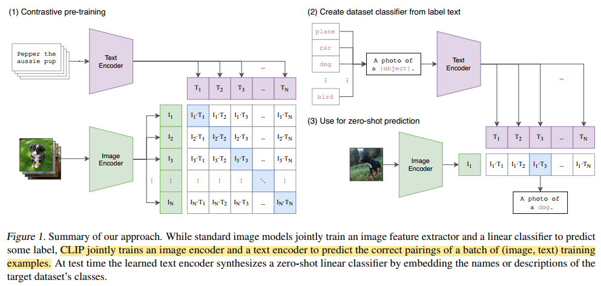
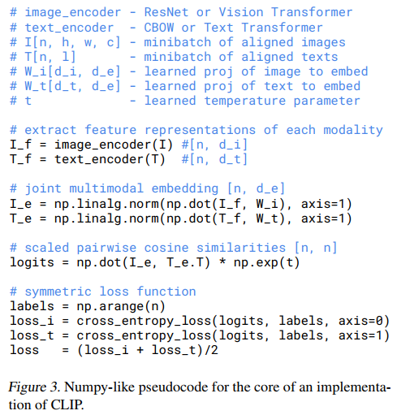

## Learning Transferable Visual Models From Natural Language Supervision (CLIP)
**OpenAI**
**Alec Radford, ..., Ilya Sutskever**

**Summary**
"We demonstrate that the simple pre-training task of predicting which caption goes with which image is an efficient and scalable way to learn SOTA image representations from scratch on a dataset of 400 million (image, text) pairs collected from the internet."
"We study the performance of this approach by benchmarking on over 30 different existing computer vision datasets, spanning tasks such as OCR, action recognition in videos, geo-localization, and many types of fine-grained object classification. The model transfers non-trivially to most tasks and is often competitive with a fully supervised baseline without the need for any dataset specific training."

tl;dr
This work attempts to replicate the success of NLP pre-training on web-scale dataset to image representation learning.

Pre-training with image text pairs on web-scale dataset can achieve SOTA performance, using linear probe/zero-shot after pre-training, compared to fully supervised training, across a wide range of CV tasks such as OCR, action recognition, geo-localization, and many fine-grained object classification. In comparison, a fully supervised model may achieve SOTA performance on one dataset, but will degrades significantly on other datasets.

The model is trained on 400 million image-text pairs.

**Method**
The framework mainly uses an image encoder and a text encoder to embed image-text pair separately and applies a contrastive loss (InfoNCE). "CLIP learns a multi-modal embedding space by jointly training an image encoder and text encoder to maximize the cosine similarity of the image and text embeddings of N real pairs in the batch while minimizing the cosine similarity of the embedding of the $N^2 - N$ incorrect pairings."

The model is trained from scratch, with ImageNet pre-trained weight initialization. Only random square cropping and resizing are used for data augmentation. The temperature parameter $\pi$, which controls the range of the logits in the softmax, is directly optimized during training, as a log-parameterized multiplicative scalar to avoid turning as a hyper-parameter.

Two image encoder architectures are tested: ResNet-50 with some modifications and Vision Transformer EfficientNet. Transformer is used as the text encoder. See more details in paper about model scaling and model training. In short, larger model has better performance.

**Experiments, Findings, and Conclusions**
* Model trained on a dataset of such scale can transfer the learned visual representation well in zero-shot setting. Zero-shot CLIP is competitive to a fully-supervised baseline (e.g., ResNet-50).
* Prompt engineering, such as using a template `A photo of {label}`, is a good default option to specify the content of the image.
* Zero-shot CLIP performance scales smoothly as a function of model compute.
* CLIP features are more robust to distribution shift, compared to models trained on ImageNet.
* If CLIP model is fine-tuned on one dataset, the performance may improve, but at the cost of robustness degradation overall (on other datasets/tasks).
* One suspicion is CLIP may have been trained on data that overlap with the evaluation datasets. More analysis is included in the paper, see detail from the paper.

**Learnings and Thoughts**
* In modern deep learning, or any other modeling efforts, scale (data size, model size, compute) triumphs over techniques. Simple and scalable ideas may lead to better model.
* The success of CLIP, as concluded by many others, are largely the result of a giant and great dataset. The curation of such a dataset is paramountly important.
* CLIP considers image as a whole. There still remains work to be done to unleash more power for tasks like segmentation, which deals with image at a finer scale.